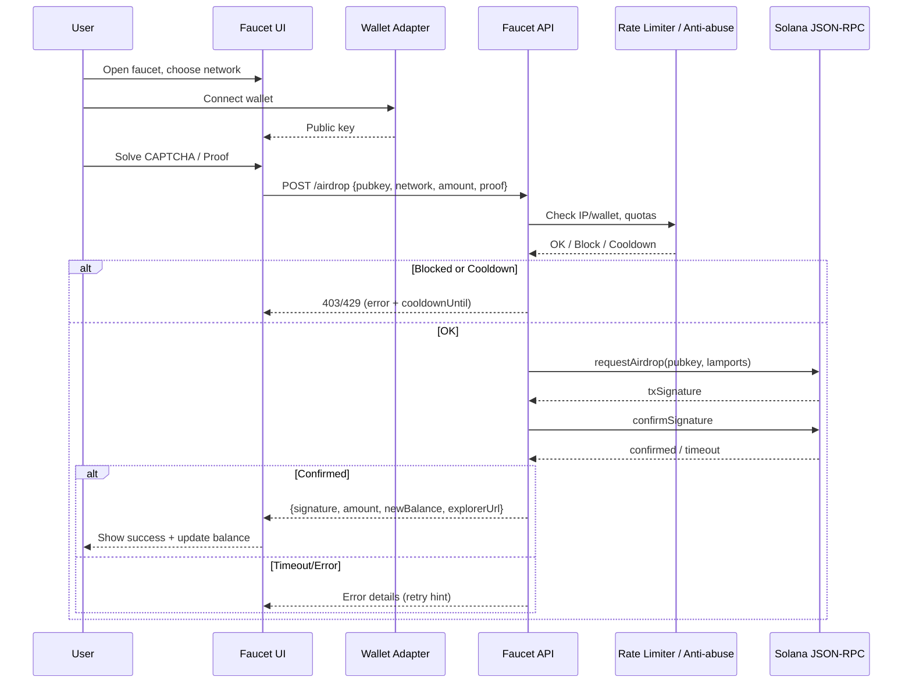

# Solana Faucet: A Full Guide to the Crypto Airdrop 💧

> [!IMPORTANT]\
> In the fast-paced world of decentralized finance (DeFi), one of the most effective ways to encourage adoption and empower users is through a **crypto airdrop**. Enter **Solana Faucet**, a dedicated **Crypto Airdrop Campaign** designed to distribute free SOL tokens across the **DeFi, Web3, wallet, and exchange** ecosystems. Operating primarily on the **Solana blockchain**, this initiative helps **crypto traders, investors, and Web3 users** test applications, explore integrations, and strengthen community participation.

Whether you are a developer looking to test smart contracts, or a trader curious about the network, **Solana Faucet** offers a unique opportunity to experience the Solana ecosystem at no financial cost.

---

## 🌐 Overview

**Solana Faucet** is more than just a token giveaway—it’s a bridge to Web3 adoption. Faucets in the crypto space are platforms that distribute small amounts of tokens to help users perform transactions, test applications, or simply explore blockchain functionality.

> [!NOTE]\
> The **Solana Faucet campaign** allows participants to request free tokens for development (on Devnet/Testnet) or in rare cases through promotional community events. These airdrops ensure that users can experiment with wallets, decentralized apps (dApps), and exchanges without financial risk.

By providing **crypto airdrops** through Solana Faucet, the project reduces barriers to entry, encourages exploration, and supports the wider mission of decentralization.

---

## 💎 Benefits

Joining the **Solana Faucet crypto airdrop** comes with multiple advantages:

* **Free access to SOL tokens** (testnet or promotional): No cost required to participate.
* **Hands-on blockchain learning**: Newcomers can experiment with transactions safely.
* **Community empowerment**: Distributing tokens to real users encourages loyalty.
* **Onboarding for dApps**: Developers can attract testers by guiding them to faucets.
* **Gateway to DeFi/Web3**: Explore staking, swapping, or liquidity pools without large upfront investment.

---

## 📊 Token Distribution

The structure of **Solana Faucet airdrops** can vary. Below is a simplified model showing how tokens are typically allocated:

| Distribution Type        | Percentage | Purpose                                                     |
| ------------------------ | ---------- | ----------------------------------------------------------- |
| Developer/Testnet Faucet | 60%        | Tokens distributed on Devnet or Testnet for experimentation |
| Community Airdrops       | 20%        | Promotional events, community quests, or campaigns          |
| Partnerships             | 10%        | Distributed via wallets, dApps, or Web3 integrations        |
| Reserve                  | 10%        | Held for future campaigns and growth                        |

*Accessibility note: This table outlines different distribution types and their respective percentage shares.*

---

## ✅ Eligibility Rules

Not everyone automatically qualifies. Here are typical requirements for **Solana Faucet crypto airdrops**:

1. **Wallet Address**: Must own a Solana-compatible wallet (Phantom, Solflare, or hardware wallets).
2. **One Claim Per User**: Multiple requests from the same wallet are restricted.
3. **Basic On-Chain Activity**: Sometimes minimal interaction with dApps or transactions is required.
4. **Community Tasks**: Certain promotional campaigns may ask for social engagement (Twitter, Discord, Telegram).
5. **Compliance Checks**: Depending on regulations, some users may need to pass a basic verification step.

---

## 🔗 Integrations (Wallets & Chains)

**Solana Faucet** integrates seamlessly with leading Web3 wallets and platforms:

* **Phantom Wallet** 👻: User-friendly and widely supported.
* **Solflare** 🔥: Desktop and mobile access with staking features.
* **Ledger/Trezor** 🔐: Hardware wallets for maximum security.

While the faucet primarily operates on **Solana**, some campaigns may bridge to **Ethereum or BSC** for broader reach. Multi-chain access ensures inclusivity for both newcomers and experienced users.

---

---

## 🎯 How to Claim

Claiming tokens from **Solana Faucet** is straightforward:

1. **Visit the official faucet website** (always check links from verified sources).
2. **Connect your wallet** (Phantom, Solflare, or Ledger)
3. **Enter your wallet address** and select the network (Devnet/Testnet or promotional mainnet).
4. **Complete any required steps**, such as captcha or community verification.
5. **Request your tokens**—distribution usually takes place instantly on test networks.

💡 **CTA Placement (after-teaser)**: *Begin for free by requesting SOL tokens through the official faucet today!*

---

## ❓ Common Questions

**Q: Are Solana Faucet tokens real?**
A: Devnet/Testnet tokens are not real and hold no monetary value. Promotional faucets may provide small amounts of real SOL for engagement.

**Q: Do I need to pay gas fees?**
A: On Solana, fees are extremely low. Faucet tokens cover most costs, especially on Devnet/Testnet.

**Q: Can I sell faucet tokens?**
A: Testnet tokens cannot be sold. Promotional mainnet tokens, if provided, can usually be traded or used.

**Q: Is it safe to use a faucet?**
A: Yes, if you use the official Solana Faucet or trusted community campaigns. Never share your seed phrase.

---

## 🌟 Final Thoughts

The **Solana Faucet crypto airdrop campaign** is a vital stepping stone for both newcomers and developers. It empowers users to test dApps, interact with wallets, and gain confidence in Web3—all without financial risk.

For developers, it provides a testing ground; for traders and enthusiasts, it’s an entry into the vibrant Solana ecosystem. With its focus on accessibility and community growth, **Solana Faucet** exemplifies how airdrops can accelerate blockchain adoption.

✨ Don’t miss out—connect your wallet and explore the faucet today.

➡️ *Get started at no charge with Solana Faucet!*
